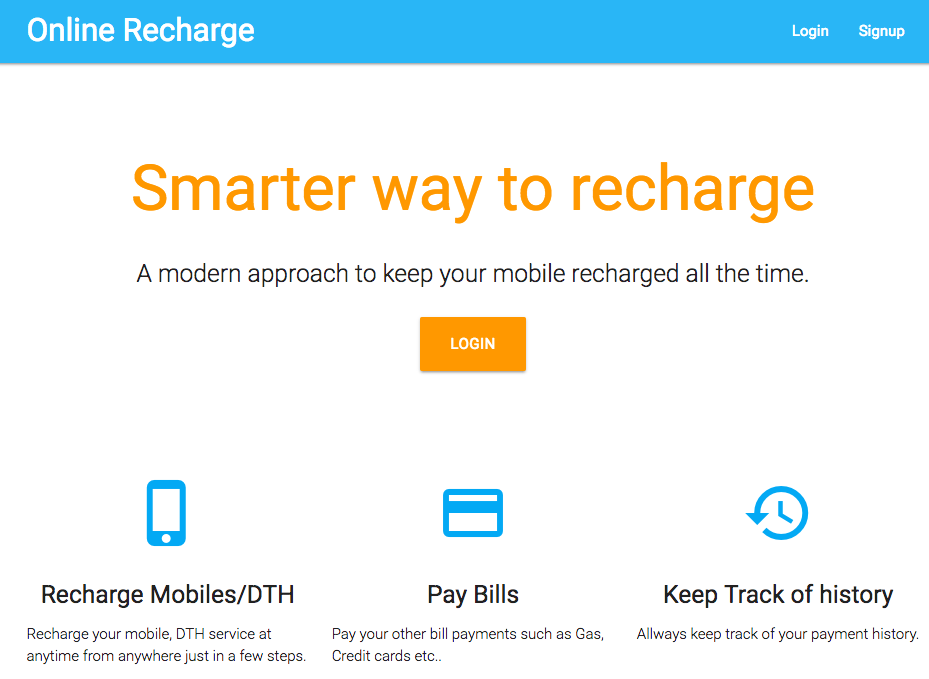
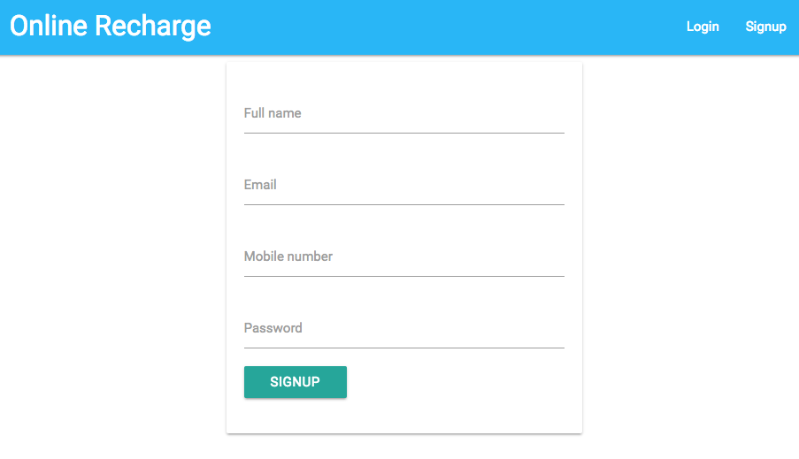
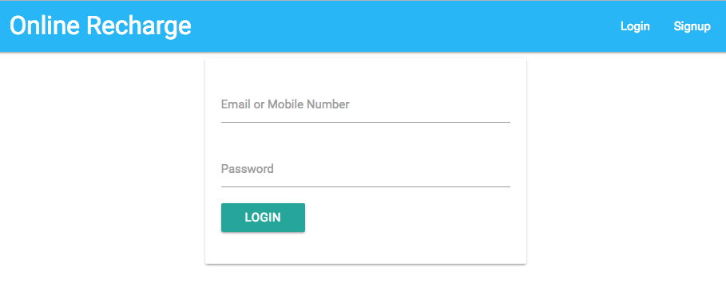
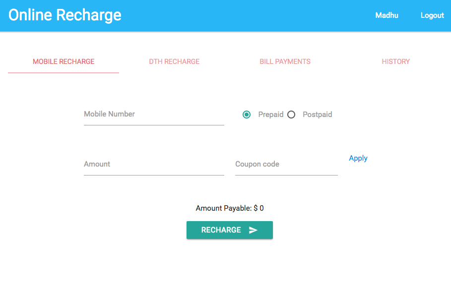
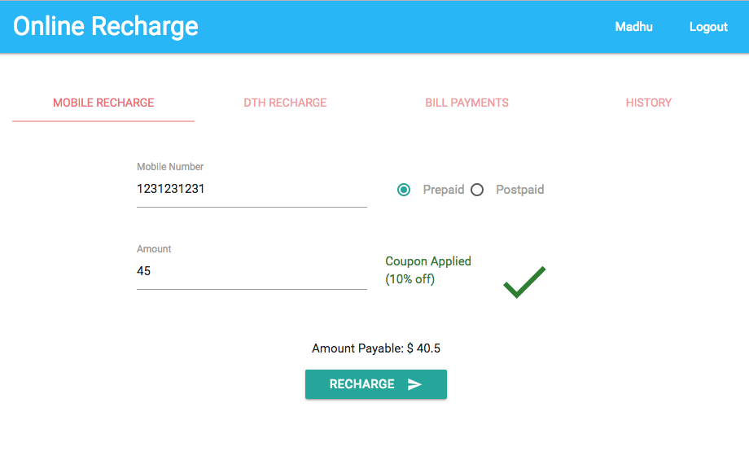
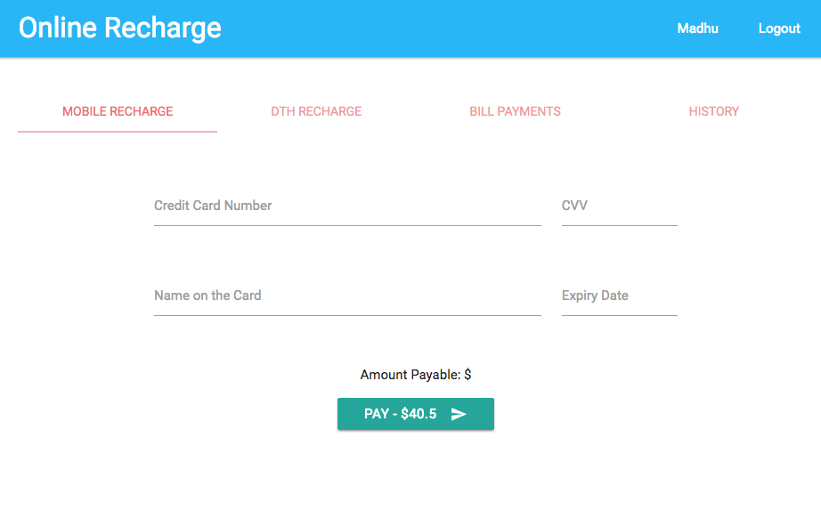
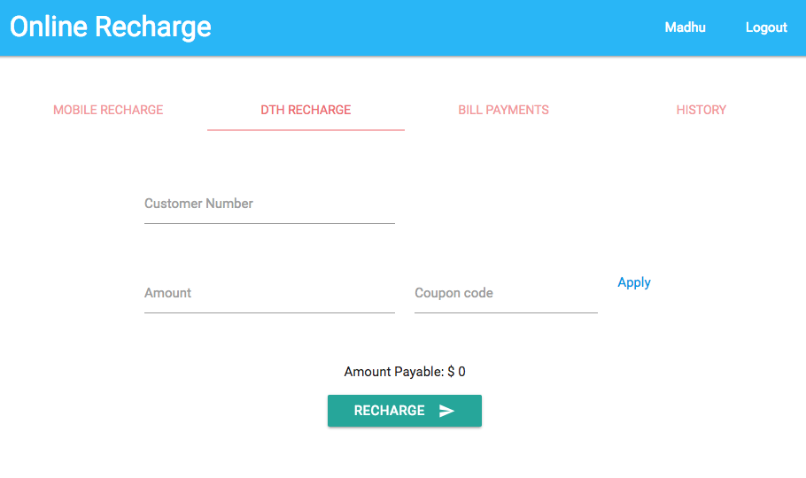
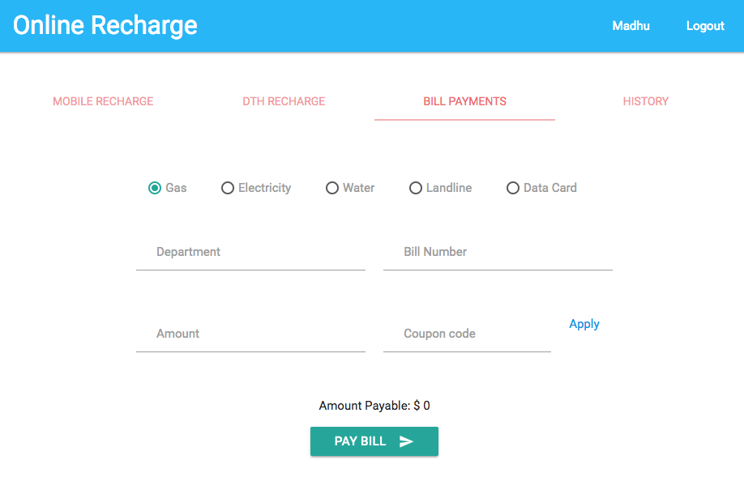
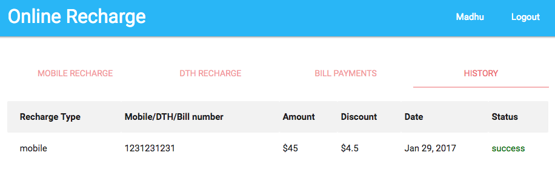

# Online Recharge Demo

This project was implemented based on the following technologies.

###### Front End
- Angular 2 (with TypeScript)
- Materialize css

###### Backend1
- Node.js
- Express

###### Backend2
- PHP
- Laravel 5.4

## Setup

To run this app, you need the following to be installed

- Node.js (version 4+)

Run the following commands to get started

###### Backend1

```
$ cd path/to/backend
$ npm install
```

###### Backend2

- Install xampp (https://www.apachefriends.org/index.html)
- install composer (https://getcomposer.org/)
- start xampp
- login to php-my-admin (localhost:port/phpmyadmin)
- create a new database with name 'recharge'.
- configure the database name in backend2/.env file

(windows)
Set PHP location in environment variables.
http://stackoverflow.com/questions/15514444/why-cant-i-use-php-artisan-cmd-in-laravel-path-win

```
$ composer install
$ php artisan migrate
$ php artisan serve
```

###### Front end

```
$ cd path/to/ui
$ npm install
$ npm install bower -g
$ bower install
```

## Run your app

###### Backend

```
$ cd path/to/backend
$ npm start
```

This starts the backend app at http://localhost:3000.

###### Front end

```
$ cd path/to/ui
$ npm start
```

This starts the front end app at http://localhost:4200.


## Preview










